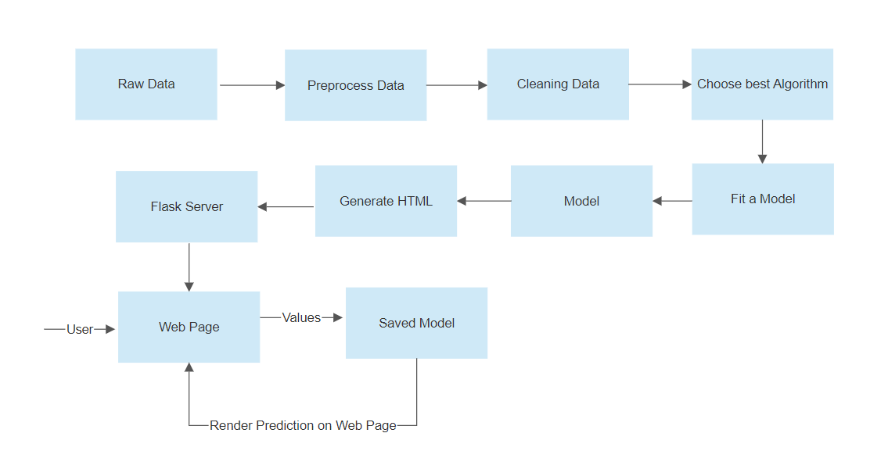

# IPL-Score-Prediction
### https://iplscore-predict.herokuapp.com/
IPL First innings score predictor, a machine learning web app created with Flask on Heroku platform.

## Overview
This is a flask web app which predicts the first inning score of Indian Premier League(IPL) with the help of Rgeressor model. The dataset is taken from https://github.com/codophobia/CricketScorePredictor . It contains the score made on each ball of the matches played in IPL from 2008 to 2017.
This project helps the fantasy cricket fans out there.

## Technical Aspect:
This project is divided into two parts:
1) Trained a Machine Learning model using Regressor Models.
2) Deployed the model using Flask on Heroku Platform.

## Workflow


## Installation
```bash
pip install -r requirements.txt
```

## Future Scope
• Consider venue as one of the aspect while creating a model.
• Add columns of the striker and non striker batsman who is playing at that moment.
• Implement this problem statement using Deep Learning(ANN).

## Contact
Any questions can be directed to nbansal1_be18@thapar.edu.


